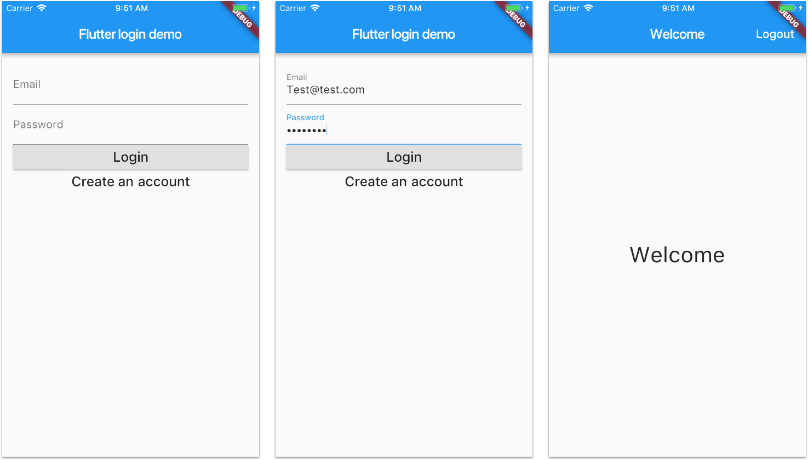

# A Semaphore demo CI/CD pipeline using Flutter

Example Flutter application and CI/CD pipeline for integrating it with Semaphore 2.0. This application demonstrates CRUD operations using class based views in Django. It also includes UI for all CRUD views.

## Preview



## Firebase configuration

You need to register the project with your own Firebase account.

- Use `com.flutter.logindemo` as your bundle / application ID when generating the Firebase project.

- Download the `ios/Runner/GoogleService-Info.plist` and `android/app/google-services.json` files as needed.

## Local Setup

Install packages
```bash
flutter pub get
```

Run the app
```bash
flutter run
```

Run the test suites
```bash
flutter test
```